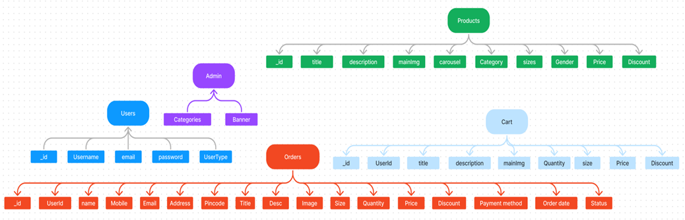

# ShopEZ - MERN E-Commerce Platform 🛒



ShopEZ is a fully-featured, production-ready E-commerce web application built entirely using the MERN stack (MongoDB, Express.js, React.js, Node.js). It provides a complete shopping flow from product browsing to secure checkout, alongside a powerful administrative dashboard to manage the platform.

## 🚀 Key Features

*   **Responsive Modern UI:** Designed with a stunning, dynamically responsive interface including glassmorphism aesthetics from the ground up natively in CSS.
*   **Complete Shopping Flow:**
    *   Dynamic Product Listings (Filterable categories, Sort by price/discount)
    *   Individual Product Detail pages with Image Carousels
    *   Shopping Cart (Size/Quantity manager)
    *   Secure Checkout Flow
*   **Role-Based Security (JWT):** Separate User and Admin roles. Admin views are securely protected by backend middleware.
*   **Razorpay Integration:** Full payment gateway integration in test mode.
*   **Admin Dashboard:**
    *   Automatically seed store with Dummy Data at the click of a button!
    *   Monitor application statistics (Users, Orders, Total Reveune)
    *   Full CRUD operation suite for managing Product listings dynamically
    *   Manage active orders and change fulfillment statuses

### Application Views
*Admin Web Dashboard Flow (Products, Orders, Dashboard, etc.)*
.png)

*The Shopping Process Flow*
.png)

---

## 🛠 Tech Stack 

**Client (Frontend)**
*   React.js over Vite (`npx create-vite`)
*   React Router DOM (for secure Client-Side Routing)
*   React Context API (for global `Auth` and `Cart` State Management)
*   Vanilla CSS (Custom extensive aesthetic UI libraries)
*   Axios (with dynamic Interceptors for JWT attach)
*   React Toastify (Global User Notifications)
*   Razorpay SDK

**Server (Backend)**
*   Node.js & Express.js architecture
*   MongoDB & Mongoose
*   MongoDB Memory Server (Auto-Fallback for local testing without installation!)
*   JWT `jsonwebtoken` for Stateless Authentication
*   Bcrypt.js for secure Password Hashing
*   Razorpay SDK (for order signature generation)

---

## ⚙️ How to Run Locally

Because ShopEZ natively features a **Smart Database Fallback**, you do not need to install MongoDB for the project to work! 

1. **Install Dependencies:**
   ```bash
   cd Server && npm install
   cd ../Client && npm install
   ```

2. **Start the Express API:**
   ```bash
   cd Server
   npm run dev
   ```
   *(If you don't have MongoDB installed locally, the server will intelligently spin up an in-memory database and auto-seed an `Admin` user for you!).*

3. **Start the Frontend UI:**
   ```bash
   cd Client
   npm run dev
   ```

4. Go to `http://localhost:5174/` or `http://localhost:5173/` in your browser.

---

### Demo Credentials
To explore the Admin portal, log in straight away using the auto-seeded credentials:
*   **Email:** `admin@shopez.com`
*   **Password:** `admin123`
*(Note: If you are using the in-memory fallback database, the store will dynamically seed this user specifically on boot).*
